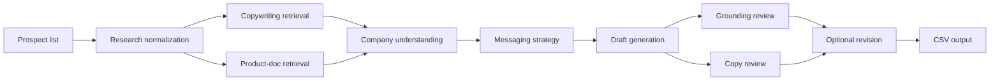

# Email SDR LangChain Flow

Reusable outbound workflow framework for:

- ingesting a prospect list
- grounding on product documentation and copywriting guidance
- building a company-understanding artifact
- generating outreach drafts
- applying review logic
- writing batch outputs to CSV

This repository is designed as a **framework template**. It is not tied to a specific product, market, or account list.

You provide:

- your product profile
- your prospect list
- optional grounding documents

The framework provides:

- the workflow
- the reasoning structure
- the message-generation pipeline
- the batch output format

Most users should not need to modify the core code in `src/email_sdr_flow/`. In normal use, you replace inputs, not logic.

## Project Overview

Outbound drafting often breaks in two places:

1. the system does not understand the target account well enough
2. the draft makes claims that are not grounded in product reality

This framework addresses both problems by separating reusable workflow logic from user-supplied inputs.

At a high level, the pipeline is:

```text
Account list
-> account understanding
-> product grounding
-> messaging strategy
-> draft generation
-> review
-> CSV output
```

It is designed for teams who want a forkable starting point for outbound research and draft generation without rebuilding orchestration, retrieval, and review flows from scratch.

## System Architecture

The current implementation works like this:

1. Load the product profile from `inputs/product_profile.json`.
2. Load the account list from `inputs/prospects.csv`, or accept a single raw/normalized account JSON for one-off runs.
3. Load copywriting docs and product docs from `knowledge/` and build in-memory retrieval indexes.
4. For each account:
   - run research planning if the input is raw
   - normalize the account into a structured research schema
   - plan one retrieval query for copywriting guidance
   - plan one retrieval query for product proof
   - retrieve snippets from both corpora
   - generate a company-understanding artifact
   - surface human-review findings if requested
   - generate a messaging strategy
   - draft the email
   - run grounding review and copy review
   - run one revision pass if reviews reject the first draft
   - generate final reasoning notes
5. Write batch outputs to CSV, JSONL, and a summary manifest.

The workflow graph is implemented in `src/email_sdr_flow/graph.py`.

In batch mode, the framework builds retrieval indexes once per run and reuses the product-doc review across rows.

### Conceptual flow



### Human-in-the-loop flow

The repository also supports a persistent review flow:

1. create a review session
2. inspect surfaced issues
3. approve, reject, or clarify by scope
4. resume the workflow without rerunning earlier approved work

Session persistence is implemented in `src/email_sdr_flow/session_store.py`.

## Repository Structure

The repository is split into **framework logic** and **user configuration**.

### Framework logic

These files define behavior and usually should not need changes:

- `src/email_sdr_flow/graph.py`
  Workflow graph, model routing, and execution order
- `src/email_sdr_flow/schemas.py`
  Pydantic schemas for all structured stages and outputs
- `src/email_sdr_flow/prompts.py`
  Prompt templates used by the workflow
- `src/email_sdr_flow/retrieval.py`
  Document loading, indexing, retrieval, and diagnostics
- `src/email_sdr_flow/batch.py`
  CSV loading, output shaping, and batch record formatting
- `src/email_sdr_flow/cli.py`
  CLI entrypoint and run modes
- `src/email_sdr_flow/session_store.py`
  HITL session persistence and resume logic
- `src/email_sdr_flow/runtime.py`
  Logging, structured stage execution, retries, and output validation

### User configuration inputs

These are the files and folders users are expected to replace:

- `inputs/product_profile.json`
  Your structured product context
- `inputs/prospects.csv`
  Your account or prospect list
- `knowledge/product_docs/`
  Product documentation, capability descriptions, integration notes
- `knowledge/copywriting/`
  Copywriting principles, positioning notes, style guidance

### Runtime outputs

These are generated during execution:

- `outputs/batch_runs/<RUN_ID>/drafts.csv`
- `outputs/batch_runs/<RUN_ID>/drafts.jsonl`
- `outputs/batch_runs/<RUN_ID>/summary.json`
- `.sessions/`
  Persisted human-review sessions

## Quick Start

### 1. Clone the repository

```bash
git clone <your-fork-url>
cd email-sdr-langchain-flow
```

### 2. Install dependencies

```bash
pip install -e .[dev]
```

### 3. Configure environment variables

Copy the example file and add your keys:

```bash
cp .env.example .env
```

Set:

- `OPENAI_API_KEY`
- `DEEPSEEK_API_KEY`

### 4. Add your product information

Replace the contents of:

- `inputs/product_profile.json`
- `knowledge/product_docs/`

### 5. Add your prospect list

Replace the contents of:

- `inputs/prospects.csv`

### 6. Run batch generation

```bash
python3 -m email_sdr_flow.cli
```

By default, the batch runner writes outputs to:

- `outputs/batch_runs/<run-id>/drafts.csv`
- `outputs/batch_runs/<run-id>/drafts.jsonl`
- `outputs/batch_runs/<run-id>/summary.json`

## Configuring Your Product

Your product context lives in `inputs/product_profile.json`.

This file gives the workflow reusable product facts and positioning guidance without hardcoding them into prompts or code.

### Required fields

- `company_name`
- `product_name`
- `one_line_summary`

### Common optional fields

- `product_category`
- `ideal_customer_profile`
- `core_problem`
- `key_capabilities`
- `differentiators`
- `proof_points`
- `terminology_guardrails`
- `avoid_claims`
- `default_cta`

### Example structure

```json
{
  "company_name": "Your Company",
  "product_name": "Your Product",
  "product_category": "Short category description",
  "one_line_summary": "One-sentence product summary",
  "ideal_customer_profile": "Who the product is for",
  "core_problem": "The main problem the product solves",
  "key_capabilities": [
    "Capability one",
    "Capability two"
  ],
  "differentiators": [
    "Why this is different"
  ],
  "proof_points": [
    "Grounded proof point"
  ],
  "terminology_guardrails": [
    "Preferred terminology"
  ],
  "avoid_claims": [
    "Claims the system should avoid"
  ],
  "default_cta": "Your preferred CTA"
}
```

### How the system uses this file

The product profile is used in:

- research planning
- retrieval query planning
- company-understanding generation
- strategy generation
- draft generation
- review prompts
- human clarification context

The framework stays unchanged. You replace the product profile with your own product context.

## Providing Account Lists

Batch mode reads accounts from `inputs/prospects.csv`.

The CSV is meant to be modular. You can swap in any prospect list without changing the workflow code.

### Minimum required column

- `account_name`

### Supported columns

- `prospect_id`
- `account_name`
- `account_domain`
- `target_persona_name`
- `target_persona_role`
- `persona_name`
- `persona_role`
- `raw_company_notes`
- `raw_person_notes`
- `raw_recent_signals`
- `raw_pain_hypotheses`
- `raw_stack_signals`
- `raw_source_urls`
- `desired_cta`

### Recommended shape

At minimum, provide:

- company name
- target persona
- short notes about the account

Optional context can include:

- recent company signals
- pain hypotheses
- known tools or workflow hints
- source URLs

### Multi-value cells

List-style fields use `||` inside a single CSV cell.

Example:

```csv
account_name,target_persona_role,raw_company_notes,raw_recent_signals
Example Company,Head of Marketing,"Multi-product offering||Complex evaluation motion","Recent launch||New team expansion"
```

## Grounding Sources

Grounding documents live under `knowledge/`.

### `knowledge/product_docs/`

Put product truth here:

- product documentation
- integration notes
- capability descriptions
- implementation constraints
- supported outcomes

These documents are used to ground product claims and reduce unsupported statements in the generated draft.

### `knowledge/copywriting/`

Put messaging guidance here:

- copywriting principles
- positioning guidance
- tone/style guidance
- message structure rules

These documents help the framework choose a messaging angle and draft in a consistent style.

### Supported formats

The current implementation reads:

- `.md`
- `.txt`

If grounding docs are missing, unsupported, or empty, the run fails early with explicit validation errors.

## How the Workflow Operates

You do not need to read the code to use the framework, but it helps to understand the behavior:

1. **Input ingestion**
   The system loads the product profile, prospect list, and grounding docs.
2. **Account analysis**
   Raw prospect rows are normalized into structured account research.
3. **Company understanding**
   The framework generates a workflow-first view of how the target company likely operates and where the product fits.
4. **Product grounding**
   The system retrieves product and copywriting snippets relevant to the account.
5. **Messaging strategy**
   A strategy stage chooses the angle, pain, proof, and CTA frame.
6. **Draft generation**
   The draft stage produces subject lines and the final email body.
7. **Review logic**
   Grounding review and copy review check the draft. If the first draft is rejected, the workflow performs one revision pass.
8. **Output generation**
   The final result is written to CSV and JSONL.

### Optional HITL mode

The system can stop before drafting and surface:

- ambiguity
- contradictions
- unsupported assumptions
- overclaim risk
- clarification questions

This is useful when you want human review before allowing the workflow to continue.

## Output Format

The primary output is:

- `outputs/batch_runs/<RUN_ID>/drafts.csv`

This CSV is intentionally lightweight. It captures the key decision trail without dumping full research blobs.

### CSV columns

- `account_name`
  Target company name
- `persona`
  Persona used for the outreach
- `account_signal_used`
  Main account observation that shaped the message
- `product_proof_used`
  Main grounded product proof used in the draft
- `chosen_angle`
  Messaging wedge selected by the strategy stage
- `final_subject`
  Subject line used in the output row
- `final_draft`
  Final email body
- `status`
  Pipeline outcome for the row

### Status values

- `completed`
  The row completed the workflow
- `halted_for_review`
  The row was intentionally stopped for human review
- `blocked`
  The row could not be processed because the input row was invalid
- `failed`
  The row started execution but failed during processing

### Additional outputs

- `drafts.jsonl`
  Full structured results for each row
- `summary.json`
  Run-level counts and output paths

## Customization

This framework is designed to be adapted through configuration rather than code changes.

Common customizations:

- swap in a different `product_profile.json`
- replace the `prospects.csv` file
- add stronger product docs
- add different copywriting guidance
- override model settings with environment variables

In most cases, users should not need to edit:

- prompts
- schemas
- graph logic
- batch runner code

If you find yourself editing core logic for a normal product/account swap, that is a sign the inputs should probably be improved instead.

## Troubleshooting

### Missing environment variables

Symptom:

- run fails with `missing_env_var`

Fix:

- make sure `.env` exists or environment variables are exported
- set `OPENAI_API_KEY`
- set `DEEPSEEK_API_KEY`

### Malformed `product_profile.json`

Symptom:

- `invalid_product_profile`
- `invalid_json`

Fix:

- validate the JSON syntax
- ensure required fields are present

### Malformed `prospects.csv`

Symptom:

- `missing_csv_headers`
- `unexpected_csv_headers`
- `invalid_prospect_rows`

Fix:

- check the header row
- ensure required columns exist
- remove malformed rows or fix cell formatting

### Missing or empty grounding documents

Symptom:

- `missing_directory`
- `no_supported_documents`
- `only_empty_documents`

Fix:

- add `.md` or `.txt` files
- make sure the files contain real text
- verify you placed them in the correct `knowledge/` directory

### Weak product documentation

Symptom:

- drafts are generic
- reviews reject the draft for unsupported claims

Fix:

- add clearer product proof
- document integrations, outcomes, constraints, and safe claims
- prefer specific product facts over marketing adjectives

### Resume failures in HITL mode

Symptom:

- `session_not_ready`
- `session_missing_*`

Fix:

- make sure all review scopes are approved or clarified
- ensure the saved session includes research, snippets, and company understanding

## Contributing

Contributions are welcome.

When contributing, keep these rules in mind:

- keep the framework generic
- avoid product-specific or company-specific logic
- keep inputs modular and replaceable
- prefer configuration over hardcoding
- update documentation when behavior changes
- keep the onboarding path simple for forked users

Good contributions include:

- reliability improvements
- clearer validation or error messages
- better generic prompts
- better tests
- better docs

## Security Best Practices

- Never commit API keys.
- Configure secrets through environment variables.
- Use `.env` only for local development.
- Keep local secret files out of version control.

Recommended local files:

- `.env`
- `.env.local`
- `.env.*`

The repository ignores local env files and includes [.env.example](/Users/sachinh/email-sdr-langchain-flow/.env.example) as a safe starter.

## Notes For Template Users

If you are forking this repository for your own product:

1. replace `inputs/product_profile.json`
2. replace `inputs/prospects.csv`
3. replace or extend the documents in `knowledge/`
4. run the CLI

That is the intended customization boundary.

You should not need to rewrite the workflow to adapt the framework to your own outbound motion.
